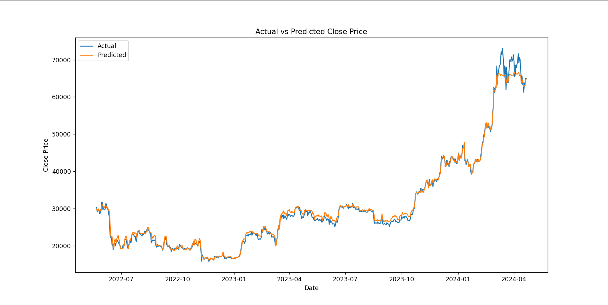

# 📈 Bitcoin Price Prediction using Random Forest Regressor 🧠

Welcome to the **Bitcoin Price Prediction** project!  
This repository demonstrates how machine learning can be used to predict **Bitcoin closing prices** using historical data and a **Random Forest Regressor** model with an accuracy of **99.36%**.

<p align="center">
  
</p>

---

## 🗂️ Table of Contents
- [🌟 Introduction](#-introduction)
- [📊 Dataset](#-dataset)
- [🛠️ Installation](#-installation)
- [🚀 Usage](#-usage)
- [📈 Results](#-results)
- [📉 Visualization](#-visualization)
- [🤝 Contributing](#-contributing)
- [📬 Contact](#-contact)

---

## 🌟 Introduction

Forecasting cryptocurrency prices is a fascinating and challenging task.  
In this project, we use **machine learning** to predict the **closing price of Bitcoin (BTC-USD)** by training a **Random Forest Regressor** on historical data. The model incorporates features such as open, high, low, volume, and temporal patterns like day, month, and day of week.

---

## 📊 Dataset

The dataset used contains historical price data for Bitcoin, including the following columns:

- `Date`
- `Open`
- `High`
- `Low`
- `Close`
- `Adj Close`
- `Volume`

📌 Ensure the dataset file is named `BTC-USD.csv` and is placed in the root directory.

---

## 🛠️ Installation

Install the required libraries by following these steps:

```bash
git clone https://github.com/Parthvora5/Bitcoin_Price_Prediction.git
cd Bitcoin_Price_Prediction
pip install -r requirements.txt
🚀 Usage
Once everything is set up:

bash
Copy
Edit
python BTC.py
The script:

Loads and preprocesses the dataset

Builds and trains a Random Forest Regressor

Evaluates model performance

Plots actual vs predicted close prices

📈 Results
The model's prediction accuracy is impressive:

Mean Squared Error (MSE): Low

Mean Absolute Error (MAE): Very low

R² Score: 0.9936 (≈ 99.36% accuracy)

📉 Visualization
Below is a comparison of actual vs predicted closing prices:

<p align="center">  </p>
Shaded regions show the prediction error to better visualize performance.

🤝 Contributing
We welcome contributions!
If you have suggestions, improvements, or want to enhance the model, feel free to:

Open an issue

Submit a pull request

Share your ideas and improvements

📬 Contact
Made with ❤️ by Parth Vora
🔗 GitHub Profile


---

Let me know if you'd like:
- A **PowerPoint slide deck** based on this project
- A **PDF one-pager summary**
- Deployment instructions (e.g., for Streamlit or Flask)
- A dashboard UI for this project

I'm happy to help you make this project even more presentation-ready!
